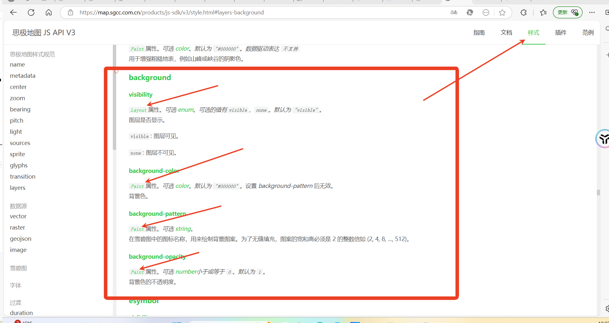
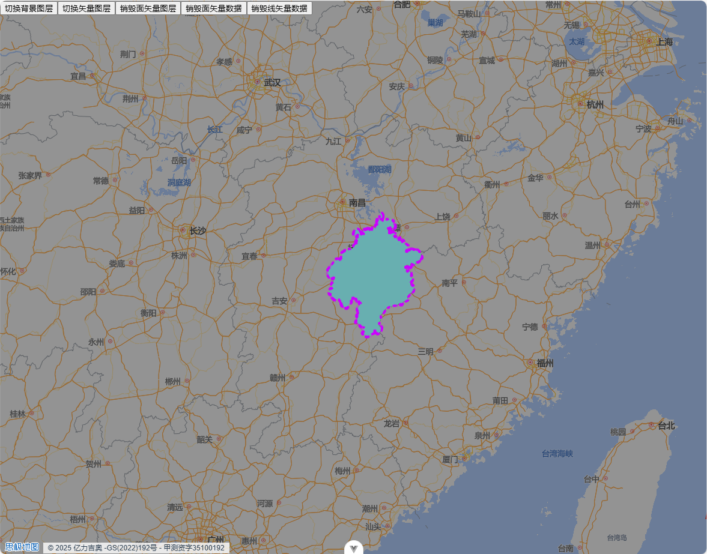

# 背景图层
**官方 api 使用**

```useVectorLayer.js
export const useVectorLayer = (map) => {
  /**
    * @description 创建背景图层，背景图层需要多次控制显隐，背景图层remove为将其设置为不可见
    * @param {Boolean} isLoaded 是否初始化一个背景图层
    * @param {Object} options 配置项
    * @param {String} options.id 图层id
    * @returns {object}
    * @property {String} id -背景图层id，与入参id一致
    * @property {object} layer -创建后的图层对象
    * @property {Function} remove -移除背景图层（将图层设置为不可见）
    */
    const addbackgroundLayer = (isLoaded, options = {}) => {
        const { id = 'bgLayer' } = options
        watch(isLoaded, (newValue, oldValue) => {
            if (newValue && !map.value.getLayer(id)) {
                map.value.addLayer({
                    id,
                    type: "background",
                    paint: {
                        "background-color": "#000",
                        "background-opacity": 0.4,
                    },
                });
            }
        })
        const trigger = () => {
            const name = map?.value?.getLayoutProperty(id, "visibility")
            console.log(name);
            map?.value?.setLayoutProperty(id, "visibility", name === 'none' ? 'visible' : 'none')
        }
        return {
            id,
            layer: map?.value?.getLayer(id),
            trigger,
            destoryLayer: () => destoryLayer(id, false)
        }
    }
})
```
::: tip

1. 背景图层的显示隐藏也可以通过两种方式实现：  
   （1）销毁创建图层  （类似v-if）
   （2）显示隐藏图层（显示隐藏类似于v-show）
   使用属性修改setLayoutProperty(id, "visibility", 'visible')
2. 初始化图层后，可以将图层 id、图层实例以及图层销毁的方法返回出去，以便在外部组件中共用，尽量减少封装后的功能与外部业务组件过多耦合.

:::
**官方api截图** 

  

## 效果展示
