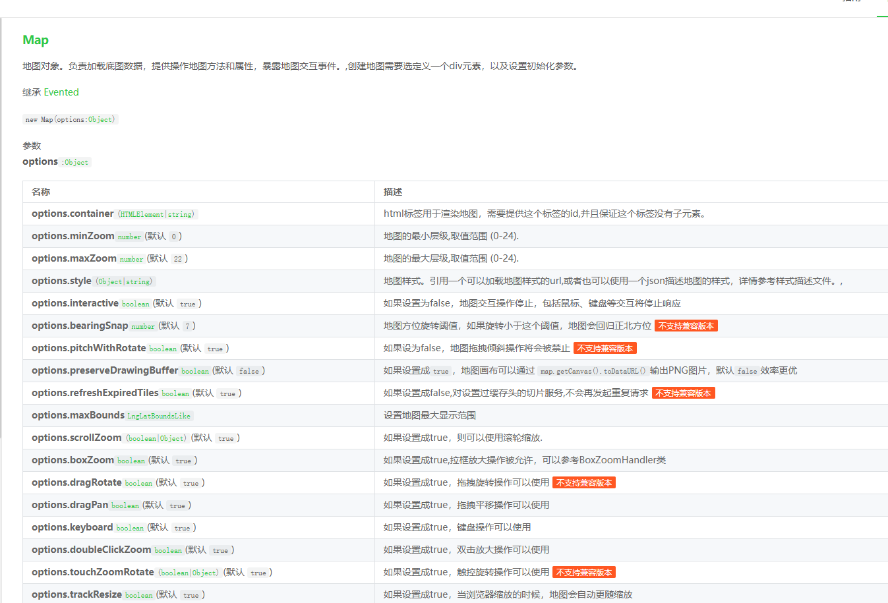
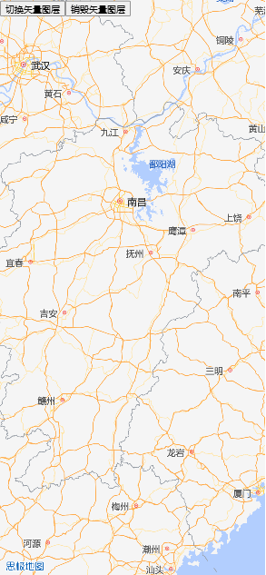

# 地图初始化及数据设置

地图实例的创建以及一些默认数据的设置

## 官方api及本地封装思路

创建地图需要一些配置参数以及预先引入sg的资源，[示例](https://jianghong2019.github.io/sgMap-demo/)中才用在线方式引入 。

**官方api截图** 



**官方api使用**
```` md
```useMapInit.js
export const sgMapInstance = shallowRef(null)
/**
    * @description 初始化地图，暴露初始化后的回调、地图实例
    * @param el {String} 地图初始化容器的id，不需要传`#`
    * @param mapconfig {object} 地图初始化参数如：中心坐标、缩放层级、矢量源
    * @param callback {Function} 回调初始化地图完成之后的回调
    * @returns void
    * @example 
    const mapconfig = {
           srcSdk: "https://map.sgcc.com.cn/maps?v=3.0.0",
           appkey: "4b9985a37eef391f9ff32c696819f605",
           appsecret: "ee7b92c92455300896b732377a662077",
           style: "aegis://styles/aegis/Streets-v2",
           zoom: 5.6,
           center: [116.06958776337888, 27.451715986601002]
       }
    useMapInit('container',this.mapconfig,(map)=>{
                   this.$emit("load", map);
                   this.$hideLoading()
               })
           	
 */
export const useMapInit = (el, mapconfig, callback) => {
    onMounted(() => {
        // 思极地图认证
        SGMap.tokenTask.login(mapconfig.appkey, mapconfig.appsecret).then(() => {
            SGMap.plugin([
                "SGMap.DistrictPlusTask",
                "SGMap.GeolocationTask", "SGMap.DirectionsTask"
            ]).then(function (res) {
                window.districtPlusTask = new SGMap.DistrictPlusTask(); // 查地图边界接口
                window.directionsTask = new SGMap.DirectionsTask(); //路径规划插件
                // 创建地图实例
                sgMapInstance.value = new SGMap.Map({
                    // 地图绑定的DOM元素ID
                    container: el,
                    // 地图样式
                    style: mapconfig.style,
                    // 默认缩放层级
                    zoom: mapconfig.zoom,
                    // 地图中心点
                    center: mapconfig.center,
                    // 地图默认字体
                    localIdeographFontFamily: "Microsoft YoHei",
                    doubleClickZoom: false, // 禁止双击放大
                    scrollZoom: true, // 禁止鼠标滚轮缩放
                    touchZoomRotate: true, // 禁止触摸缩放
                });
                sgMapInstance.value.on('load', async () => {

                    // initTool()
                    // showLayer()
                    // 加载专题数据与边界数据`
                    // await initThematic()
                    callback(sgMapInstance)
                    window.geolocationTask = new SGMap.GeolocationTask(); // 地图定位
                })
            });

        });
    })
}
```
````
::: tip
1. sgMapInstance是地图实例，后续很多功能都需要调用地图实例来下实现. 
2. SGMap是思极暴露的全局变量，全局变量中有地图、插件、样式等. 
3. mapconfig是初始化地图实例时的一些必要传参.
   1. el为地图需要绑定的dom元素，一般为id选择器
   2. zoom为地图缩放层级，数字越大地图展示的可视范围越大
   3. center为地图默认的视角位置，通常为经纬度数值

:::


**调用方法**

````md
```sgMap.vue
<script setup>
import { useMapInit } from '@/composables/useMap'
const emit = defineEmits(['loaded'])
const mapconfig = {
  srcSdk: 'https://map.sgcc.com.cn/maps?v=3.0.0',
  appkey: '4b9985a37eef391f9ff32c696819f605',
  appsecret: 'ee7b92c92455300896b732377a662077',
  style: 'aegis://styles/aegis/Streets-v2',
  zoom: 6,
  center: [116.06958776337888, 27.451715986601002],
}
useMapInit('sgMap', mapconfig, (map) => {
  console.log(map, 'sgmapvue')
  emit('loaded', map)
})
</script>
```
````
## 效果展示


