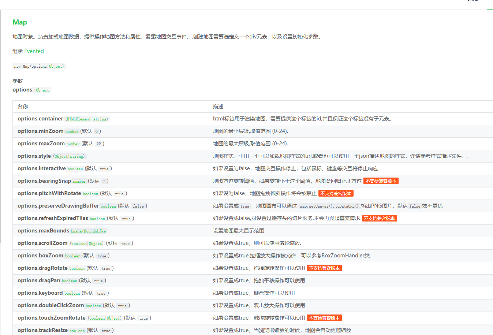
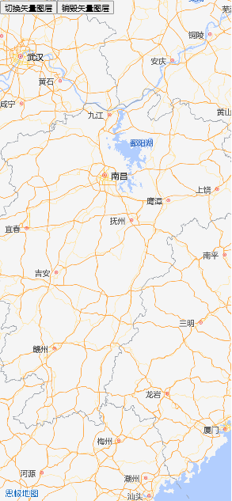

# 地图初始化及数据设置

地图实例的创建是使用思极地图的第一步。在 Vue 项目中，初始化过程涉及 SDK 认证、插件加载、Map 实例创建和后续数据设置等步骤。

## 初始化流程概览

```
加载 SDK 脚本 → 认证登录 → 加载插件 → 创建 Map 实例 → map.on('load') → 初始化后续任务
```

## 地图配置参数

创建地图实例时需要传入 `mapconfig` 配置对象，以下是常用参数说明：

| 参数 | 类型 | 必填 | 说明 |
|------|------|------|------|
| `container` | String | 是 | 地图绑定的 DOM 元素 ID（不需要 `#` 前缀） |
| `style` | String | 是 | 底图样式 ID，如 `aegis://styles/aegis/Streets-v2` |
| `zoom` | Number | 是 | 初始缩放级别（0-24） |
| `center` | Array | 是 | 地图中心点 `[经度, 纬度]` |
| `minZoom` | Number | 否 | 最小缩放级别，限制缩小范围 |
| `maxZoom` | Number | 否 | 最大缩放级别，限制放大范围 |
| `doubleClickZoom` | Boolean | 否 | 是否允许双击缩放，默认 `true` |
| `scrollZoom` | Boolean | 否 | 是否允许滚轮缩放，默认 `true` |
| `touchZoomRotate` | Boolean | 否 | 是否允许触摸手势缩放旋转，默认 `true` |
| `localIdeographFontFamily` | String | 否 | 本地中文字体，如 `"Microsoft YaHei"` |

## SDK 认证

在创建地图实例之前，必须通过 `SGMap.tokenTask.login()` 进行认证：

```javascript
// 思极地图认证（使用 appkey 和 appsecret）
await SGMap.tokenTask.login(
  '4b9985a37eef391f9ff32c696819f605',   // appkey
  'ee7b92c92455300896b732377a662077'    // appsecret
)
```

::: warning 认证必须在创建 Map 之前
`SGMap` 是思极地图 SDK 暴露的全局变量。必须先完成认证登录，后续的插件加载和地图创建才能正常进行。
:::

## 插件加载

思极地图采用插件化架构，按需加载功能模块：

```javascript
// 加载功能插件
await SGMap.plugin([
  'SGMap.DistrictPlusTask',   // 行政区划查询
  'SGMap.GeolocationTask',    // 地图定位
  'SGMap.ConvertTask',        // 坐标转换
  'SGMap.DirectionsTask',     // 路径规划
  'SGMap.RoadNetLayer',       // 路网图层
  'SGMap.DrawPolygonHandler', // 多边形绘制
  'SGMap.DrawPointHandler'    // 点绘制
])

// 插件加载完成后，初始化插件实例
window.districtPlusTask = new SGMap.DistrictPlusTask()
window.directionsTask = new SGMap.DirectionsTask()
```

| 插件 | 功能 | 使用场景 |
|------|------|----------|
| `DistrictPlusTask` | 行政区划搜索与边界查询 | 根据城市编码查询区域边界数据 |
| `GeolocationTask` | 地图定位 | 获取用户当前位置 |
| `ConvertTask` | 坐标系转换 | WGS84 ↔ GCJ-02 坐标转换 |
| `DirectionsTask` | 路径规划 | 计算两点间路径 |
| `RoadNetLayer` | 路网图层叠加 | 影像图上叠加道路标注 |
| `DrawPolygonHandler` | 多边形绘制工具 | 用户手动绘制区域 |
| `DrawPointHandler` | 点绘制工具 | 用户手动打点标记 |

## 官方 API 使用

思极地图官方初始化 API 截图如下：



### 完整初始化代码

```javascript
// useMapInit.js — 封装的地图初始化 Hook
import { shallowRef } from 'vue'

export const sgMapInstance = shallowRef(null)

/**
 * 初始化地图
 * @param {String} el - 地图容器 DOM 元素 ID
 * @param {Object} mapconfig - 地图配置参数
 * @param {Function} callback - 地图加载完成的回调
 */
export const useMapInit = (el, mapconfig, callback) => {
  onMounted(async () => {
    // 1. 思极地图认证
    await SGMap.tokenTask.login(mapconfig.appkey, mapconfig.appsecret)
    
    // 2. 加载插件
    await SGMap.plugin([
      'SGMap.DistrictPlusTask',
      'SGMap.GeolocationTask',
      'SGMap.DirectionsTask'
    ])
    
    // 初始化插件实例
    window.districtPlusTask = new SGMap.DistrictPlusTask()
    window.directionsTask = new SGMap.DirectionsTask()
    
    // 3. 创建地图实例
    sgMapInstance.value = new SGMap.Map({
      container: el,
      style: mapconfig.style,
      zoom: mapconfig.zoom,
      center: mapconfig.center,
      localIdeographFontFamily: 'Microsoft YaHei',
      doubleClickZoom: false,   // 禁用双击缩放（自定义单双击逻辑）
      scrollZoom: true,         // 允许滚轮缩放
      touchZoomRotate: true      // 允许触摸缩放
    })
    
    // 4. 地图加载完成
    sgMapInstance.value.on('load', async () => {
      // 初始化定位插件
      window.geolocationTask = new SGMap.GeolocationTask()
      
      // 执行回调（传入地图实例）
      callback(sgMapInstance)
    })
  })
}
```

### 为什么用 shallowRef

地图实例是大型复杂对象，包含大量内部属性和方法：

- **`ref`** 会对对象进行深度响应式代理，遍历每一层属性造成性能浪费
- **`shallowRef`** 只在 `.value` 层面追踪变化，不会深度代理内部属性
- 地图实例不需要深度响应式，只需跟踪地图实例本身的替换（如重新初始化）

```javascript
// ✅ 推荐：使用 shallowRef
const sgMapInstance = shallowRef(null)
sgMapInstance.value = new SGMap.Map({ ... })  // 只追踪 .value 替换

// ❌ 不推荐：使用 ref
const sgMapInstance = ref(null)  // 会深度代理地图内部属性，性能差
```

::: tip
`shallowRef` 包装后，在模板和组合式函数中仍可通过 `.value` 或自动解包访问地图实例，不影响使用。
:::

## 调用方法

在 Vue 组件中使用封装好的 `useMapInit`：

```vue
<!-- SgMap.vue -->
<template>
  <div id="sgMap" style="width: 100%; height: 100%"></div>
</template>

<script setup>
import { useMapInit } from '@/composables/useMap'

const emit = defineEmits(['loaded'])

const mapconfig = {
  srcSdk: 'https://map.sgcc.com.cn/maps?v=3.0.0',
  appkey: '4b9985a37eef391f9ff32c696819f605',
  appsecret: 'ee7b92c92455300896b732377a662077',
  style: 'aegis://styles/aegis/Streets-v2',
  zoom: 6,
  center: [116.06958776337888, 27.451715986601002]
}

useMapInit('sgMap', mapconfig, (map) => {
  console.log('地图实例:', map)
  emit('loaded', map)
})
</script>
```

::: tip 注意事项
1. **sgMapInstance** 是地图实例，后续所有功能（添加图层、事件绑定、视图控制）都通过它调用
2. **SGMap** 是思极地图 SDK 暴露的全局变量，包含 `Map`、`Popup`、`plugin`、`tokenTask` 等核心 API
3. **mapconfig** 中的 appkey/appsecret 是密钥信息，生产环境建议通过环境变量管理
4. **容器 DOM** 需要在地图初始化前存在于页面中，且必须有明确的宽高
:::

## 效果展示



