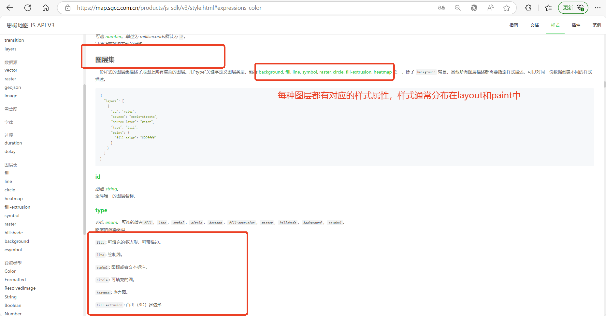
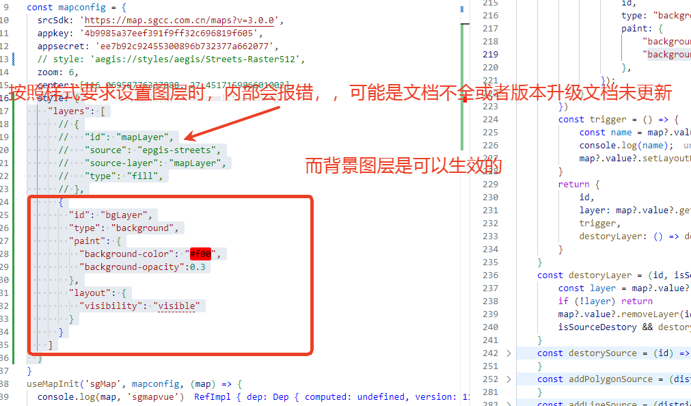
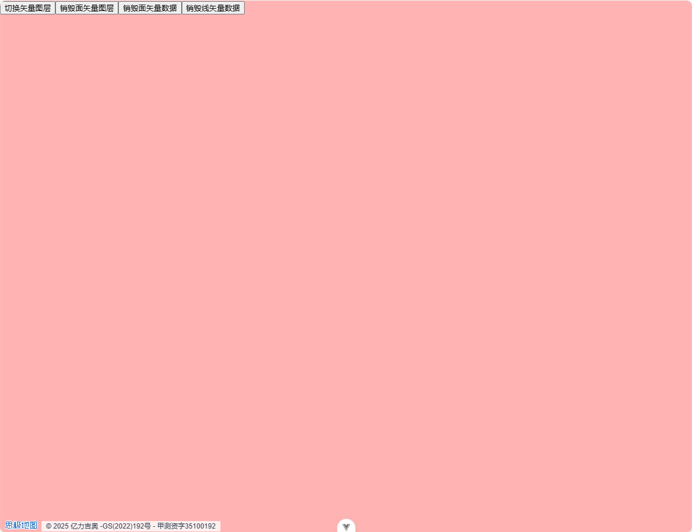
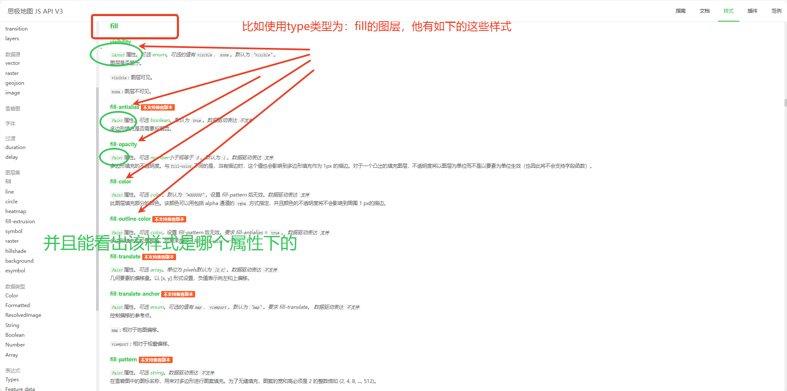
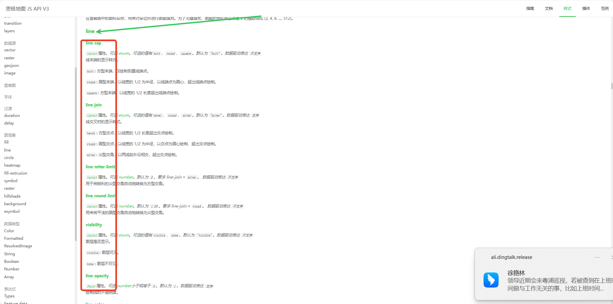
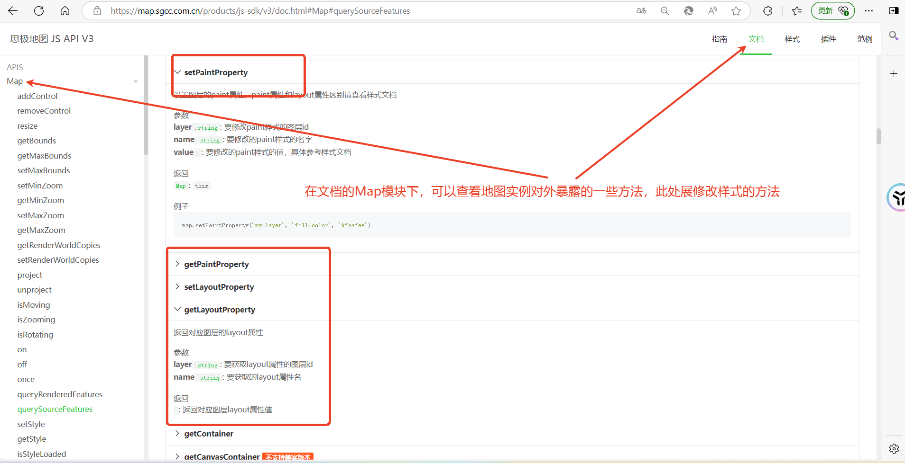

# 样式


::: tip
图层有两个子属性用来确定图层中的数据如何被渲染：layout 和 paint 属性。

Layout 属性出现在图层的 'layout'对象中。它将被应用于渲染过程的早期阶段，其他图层可以通过 'ref'属性来共享此图层的 layout 属性，应当尽可能地使用此功能。这将会减少处理时间，并允许图层间共享 GPU 内存和其他资源。

Paint 属性被应用于渲染过程的后期阶段。一个共享其他图层 layout 属性的图层可以设置不同的 paint 属性。Paint 属性出现在图层的 'paint'对象中。图层可以设置特定类别的 paint 属性，根据地图设置的类名称进行调用。例如，图层的'paint.night'属性将会在地图设置了 'night' 类名时生效。
:::

## 初始化设置样式

按照官方样式说明设置初始化图层



但是底图会报错，加载失败，只有背景图是可以正常展示的，所以可能是版本升级文档没及时更新，api 属性等有变动造成的  
 

## 根据图层的属性设置图层样式属性

**官方 api 截图**

可以在样式文档的对应部分查看该类型图层具备的可用属性  
 

**官方 api 使用**

以`fill`类型为例,设置了其背景色、透明度及是否隐藏：

```js
map.value?.addLayer({
    id,
    type: "fill",
    source: {
        type: "geojson",
        data: {
            type: "FeatureCollection",
            features: [],
        },
    },
    paint: {
        "fill-color": ["get", "color"],
        "fill-opacity": 1
    },
    layout: {
    	"visibility": "visible",
    },
});
```
以`line`类型为例,设置了其线条的颜色宽度圆角等：
 
```js
map.value?.addLayer({
    id,
    type: "fill",
    source: {
        type: "geojson",
        data: {
            type: "FeatureCollection",
            features: [],
        },
    },
    paint: {
        "line-color": ["get", "lineColor"],
        "line-width": ["get", "lineWidth"],
        "line-dasharray": [1, 2],
        "line-offset": -2
    },
    layout: {
    	"line-cap": "round",
        "line-join": "round",
    },
});
```
## 获取、修改图层样式属性
**官方 api 截图**

 

 **官方 api 使用**
 以`background`背景图层为例,以下展示使用`getLayoutProperty`和`setLayoutProperty`切换图层显示隐藏状态

 ```useVectorLayer.js
 /**
     * @description 创建背景图层，背景图层需要多次控制显隐，背景图层remove为将其设置为不可见
     * @param {Boolean} isLoaded 是否初始化一个背景图层
     * @param {Object} options 配置项
     * @param {String} options.id 图层id
     * @returns {object}
     * @property {String} id -背景图层id，与入参id一致
     * @property {object} layer -创建后的图层对象
     * @property {Function} remove -移除背景图层（将图层设置为不可见）
     */
const addbackgroundLayer = (isLoaded, options = {}) => {
    const { id = 'bgLayer' } = options
    watch(isLoaded, (newValue, oldValue) => {
        if (newValue && !map.value.getLayer(id)) {
            map.value.addLayer({
                id,
                type: "background",
                paint: {
                    "background-color": "#000",
                    "background-opacity": 0.4,
                },
            });
        }
    })
    const trigger = () => {
        const name = map?.value?.getLayoutProperty(id, "visibility")
        console.log(name);
        map?.value?.setLayoutProperty(id, "visibility", name === 'none' ? 'visible' : 'none')
    }
    return {
        id,
        layer: map?.value?.getLayer(id),
        trigger,
        destoryLayer: () => destoryLayer(id, false)
    }
}
```

```sceneWork.vue

<script setup>
import { sgMapInstance, useVectorLayer, isLoaded } from '@/composables/useMap'
const { getDistrict, addbackgroundLayer, addPolygonLayer, addLineLayer, addPolygonSource, addLineSource } = useVectorLayer(sgMapInstance)
/* 添加背景图层 */
const { destoryLayer: destoryBg, trigger: triggerBg } = addbackgroundLayer(isLoaded)
</script>

<template>
  <main absolute w-full z-5>
    <button :disabled="isPending" @click="triggerBg">切换背景图层</button>
  </main>
</template>

```
### 效果展示
<video width="320" height="200" controls>
  <source src="../images/demo-2.mp4" type="video/mp4">
</video>