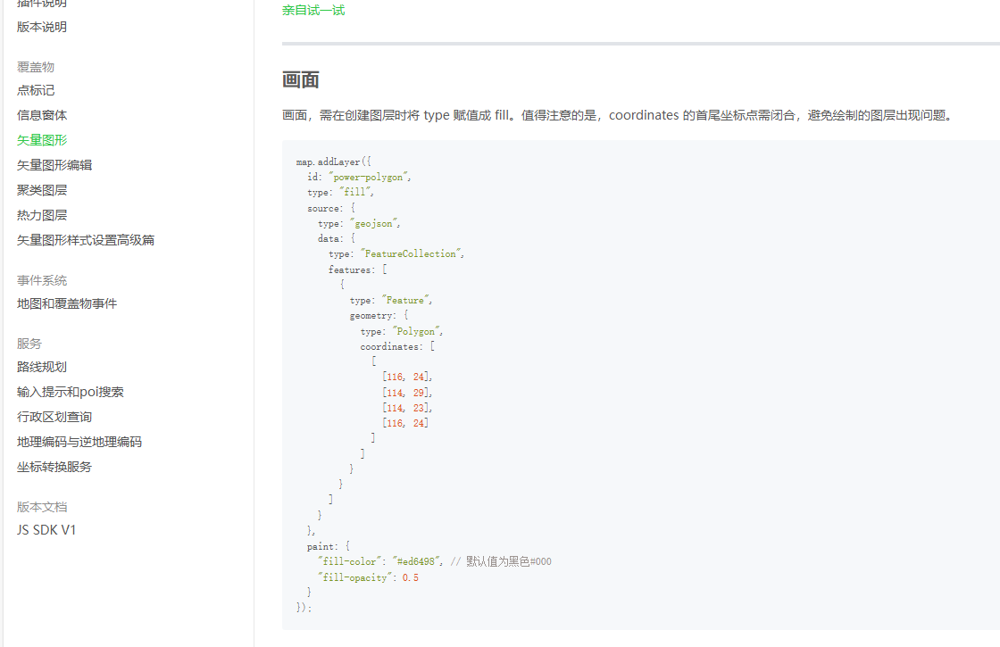

# 矢量图层

获取到地图实例后，可以创建矢量图层，图层设置一次即可，后续数据改变是更改数据源

## 图层创建

创建地图需要一些配置参数以及预先引入sg的资源，[示例](https://jianghong2019.github.io/sgMap-demo/)中才用在线方式引入 。

**官方api截图** 
以创建面图层为例


**官方api使用**
```` md
```useVectorLayer.js
export const useVectorLayer = (map) => {
    const removeLayer = (id) => {
        map?.value.removeLayer(id)
        removeLayerSource(id)
    }
    const removeLayerSource = (id) => {
        map.value?.getSource(id).setData({
            type: "FeatureCollection",
            features: [],
        });
        map?.value.removeSource(id)
    }
    const setPolygonSource = (properties, layerId, level) => {
        const list = properties.sub_districts || []
        let features = []
        list.map((r) => {
            const {
                shape: geometry
            } = r
            features.push({
                type: "Feature",
                geometry,
                properties: {
                    color: '#68AFB0',
                    ...r
                },
            })
        })
        console.log(features, "面数据", layerId);
        map.value?.getSource(layerId).setData({
            type: "FeatureCollection",
            features
        });
        return list
    }
    const addPolygonLayer = (district, id = 'polygonLayer') => {
        const polygonSource = ref(null)
        watch(district, (newValue, oldValue) => {
            if (!newValue) return
            if (!map.value?.getLayer(id)) {
                map.value?.addLayer({
                    id,
                    type: "fill",
                    source: {
                        type: "geojson",
                        data: {
                            type: "FeatureCollection",
                            features: [],
                        },
                    },
                    paint: {
                        "fill-color": ["get", "color"],
                        "fill-opacity": 1
                    },
                    // paint: {
                    // 	"fill-color": ["get", "color"],
                    // 	"fill-opacity": ["get", "opacity"]
                    // },
                });
            }
            polygonSource.value = setPolygonSource(newValue, id)
        })
        return {
            polygonSource,
            id,
            layer: map.value?.getLayer(id),
            removeLayer: () => removeLayer(id)
        }
    }
}
```
````
::: tip
1. 图层上的元素显隐可以通过两种方式实现：销毁图层；销毁（置空）数据源。当决定需要销毁某个图层时，尽量一并将其所有数据源都销毁.
2. 初始化图层后，可以将图层id、图层实例以及图层销毁的方法返回出去，以便在外部组件中共用，尽量减少封装后的功能与外部业务组件过多耦合.
3. 具体的图层及要素样式可以根据业务区需求做修改. 
4. 创建图层及数据源时，一定要创建唯一id，对唯一id可以统一管理，通过id可以获取到很多有用的东西：
   1. map.value?.getLayer(id) - 获取图层
   2. map.value?.getSource(layerId).setData({type: "FeatureCollection",features}) - 获取数据源，并给数据源重新添加数据（页面要素更新）
   3. map?.value.removeLayer(id) - 销毁图层
   4. map?.value.removeSource(id) - 销毁数据源

:::


**调用方法**

````md
```sceneWork.vue
<script setup>
    /* 模拟数据 */
    const adCode = ['361000', '360500', '360100', '360300', '360800']
    import { sgMapInstance, useVectorLayer } from '@/composables/useMap'
    const { getDistrict, addPolygonLayer } = useVectorLayer(sgMapInstance)
    const randomItem = ref('')
    const handlerLayer = async () => {
      randomItem.value = adCode[Math.floor(Math.random() * adCode.length)]
      console.log('通过城市编码查询城市边界数据', randomItem)
    }
    const { district, isPending } =  getDistrict(randomItem)
    /* 添加多边形图层 */
    const { removeLayer } = addPolygonLayer(district)
</script>
<template>
  <main absolute w-full z-5>
    <button :disabled="isPending" @click="handlerLayer">切换矢量图层</button>
    <button :disabled="isPending"  @click="removeLayer">销毁矢量图层</button>
  </main>
</template>
```
````

## 视频演示
<video width="320" height="240" controls>
  <source src="../images/demo-1.mp4" type="video/mp4">
</video>
