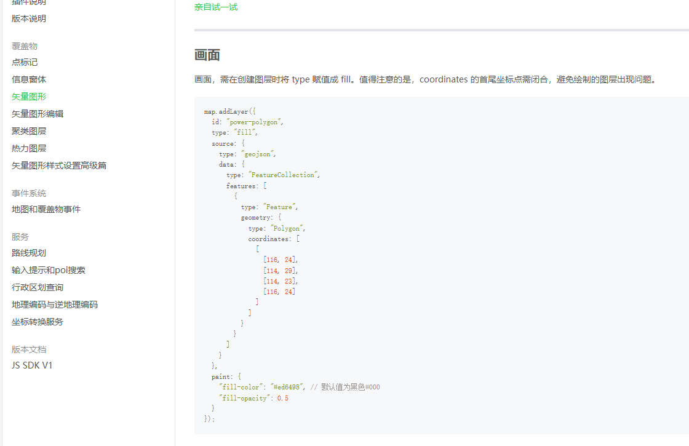

# 矢量图层

获取到地图实例后，可以创建矢量图层，图层设置一次即可，后续数据改变是更改数据源

## 图层创建

创建地图需要一些配置参数以及预先引入 sg 的资源，[示例](https://jianghong2019.github.io/sgMap-demo/)中才用在线方式引入 。

**官方 api 截图**
以创建面图层为例


**官方 api 使用**

````md
```useVectorLayer.js
export const useVectorLayer = (map) => {
     const addPolygonLayer = (district, { id = 'polygonLayer', isAddSource = false }) => {
        const source = ref(null)
        watch(district, (newValue, oldValue) => {
            if (!newValue) return
            if (!map.value?.getLayer(id)) {
                map.value?.addLayer({
                    id,
                    type: "fill",
                    source: {
                        type: "geojson",
                        data: {
                            type: "FeatureCollection",
                            features: [],
                        },
                    },
                    paint: {
                        "fill-color": ["get", "color"],
                        "fill-opacity": 1
                    },
                    // paint: {
                    // 	"fill-color": ["get", "color"],
                    // 	"fill-opacity": ["get", "opacity"]
                    // },
                });
            }
            source.value = isAddSource ? addPolygonSource(newValue, id) : null
        })
        console.log(map);

        return {
            source,
            id,
            layer: map.value?.getLayer(id),
            destoryLayer: (isSourceDestory) => destoryLayer(id, isSourceDestory)
        }
    }
    /**
         * @description 业务层-三期-待办工单-计划点连线图层
         * @param {array} source 图层所需数据
         * @param {object} source.properties 图元所需的属性，可配置与`属性驱动`相对应的控制字段
         * @param {String} id - 图层id-可用于调用地图方法的传参-唯一
         * @returns {object} 返回图层信息和图层数据源信息以及图层、数据源销毁方法
         * @property {array} featureSource 图层数据源
         * @property {Function} -destory 销毁当前图层
         * @property {Function} -remove 销毁当前图层所加载的数据源
         */
    const addLineLayer = (district, { id = 'lineLayer', isAddSource = false }) => {
        const source = ref(null)
        watch(district, (newValue, oldValue) => {
            if (!newValue) return
            if (!map.value?.getLayer(id)) {
                map.value?.addLayer({
                    id,
                    type: "line",
                    source: {
                        type: "geojson",
                        data: {
                            type: "FeatureCollection",
                            features: [],
                        },
                    },
                    layout: {
                        "line-cap": "round",
                        "line-join": "round",
                    },
                    paint: {
                        "line-color": ["get", "lineColor"],
                        "line-width": ["get", "lineWidth"],
                        "line-dasharray": [1, 2],
                        "line-offset": -2
                    },
                });
            }
            source.value = isAddSource ? addLineSource(newValue, id) : null
        })
        return {
            id,
            layer: map.value?.getLayer(id),
            destoryLayer: (isSourceDestory) => destoryLayer(id, isSourceDestory)
        }
    }
    const destoryLayer = (id, isSourceDestory = true) => {
        const layer = map?.value?.getLayer(id) ?? null
        if (!layer) return
        map?.value?.removeLayer(id)
        isSourceDestory && destorySource(id)
    }
    const destorySource = (id) => {
        const layer = map?.value?.getLayer(id) ?? null
        const source = map.value?.getSource(id)
        if (!source) return
        map.value?.getSource(id).setData({
            type: "FeatureCollection",
            features: [],
        });
        !layer && map?.value.removeSource(id)
    }
    const addPolygonSource = (district, id) => {
        console.log(district, id);
        watch(district, (newValue, oldValue) => {
            const features = newValue?.map((r) => {
                return {
                    type: "Feature",
                    geometry: r.shape,
                    properties: {
                        color: '#68AFB0',
                        ...r
                    },
                }
            })
            console.log(features, "面数据", id, map.value?.getSource(id));
            const currentSource = map.value?.getSource(id)
            const source = {
                type: "FeatureCollection",
                features
            }
            if (!currentSource) {
                map.value?.addSource(id, source)
            } else {
                map.value?.getSource(id)?.setData(source);
            }
        })
        return {
            destorySource: () => destorySource(id)
        }

    }
    const addLineSource = (district, id) => {
        watch(district, (newValue, oldValue) => {
            const features = newValue?.map((r) => {
                console.log(r.shape.coordinates[0][0]);

                return {
                    type: "Feature",
                    geometry: {
                        type: "LineString",
                        coordinates: r.shape?.coordinates?.[0]?.[0] ?? [],
                    },
                    properties: {
                        color: '#f00',
                        lineColor: '#c0f',
                        lineWidth: 4,
                        ...r
                    },
                }
            })
            console.log(features, "线数据", id, map.value?.getSource(id));
            const currentSource = map.value?.getSource(id)
            const source = {
                type: "FeatureCollection",
                features
            }
            if (!currentSource) {
                map.value?.addSource(id, source)
            } else {
                map.value?.getSource(id)?.setData(source);
            }
        })
        return {
            destorySource: () => destorySource(id)
        }
    }
}
```
````

::: tip

1. 图层上的元素显隐可以通过两种方式实现：销毁图层；销毁（置空）数据源。当决定需要销毁某个图层时，尽量一并将其所有数据源都销毁.
2. 初始化图层后，可以将图层 id、图层实例以及图层销毁的方法返回出去，以便在外部组件中共用，尽量减少封装后的功能与外部业务组件过多耦合.
3. 具体的图层及要素样式可以根据业务区需求做修改.
4. 创建图层及数据源时，一定要创建唯一 id，对唯一 id 可以统一管理，通过 id 可以获取到很多有用的东西：
   1. map.value?.getLayer(id) - 获取图层
   2. map.value?.getSource(layerId).setData({type: "FeatureCollection",features}) - 获取数据源，并给数据源重新添加数据（页面要素更新）
   3. map?.value.removeLayer(id) - 销毁图层
   4. map?.value.removeSource(id) - 销毁数据源

:::

**调用方法**

````md
```sceneWork.vue
<script setup>
    /* 模拟数据 */
    const adCode = ['361000', '360500', '360100', '360300', '360800']
    import { sgMapInstance, useVectorLayer } from '@/composables/useMap'
    const { getDistrict, addPolygonLayer } = useVectorLayer(sgMapInstance)
    const randomItem = ref('')
    const handlerLayer = async () => {
      randomItem.value = adCode[Math.floor(Math.random() * adCode.length)]
      console.log('通过城市编码查询城市边界数据', randomItem)
    }
    const { district, isPending } =  getDistrict(randomItem)
    /* 添加多边形图层 */
    const polygonId = 'polygon_1'
    const lineId = 'line_1'
    const { destoryLayer } = addPolygonLayer(district, { id: polygonId, isAddSource: false })
    const { destoryLayer: distoryLineLayer } = addLineLayer(district, { id: lineId, isAddSource: false })
    /* 添加多边形数据源 */
    const { destorySource: destoryPolygonSource } = addPolygonSource(district, polygonId)
    /* 添加多边形数据源 */
    const { destorySource: destoryLineSource } = addLineSource(district, lineId)
</script>
<template>
  <main absolute w-full z-5>
    <button :disabled="isPending" @click="handlerLayer">切换矢量图层</button>
    <button :disabled="isPending" @click="destoryLayer(false)">销毁面矢量图层</button>
    <button :disabled="isPending" @click="destoryPolygonSource">销毁面矢量数据</button>
    <button :disabled="isPending" @click="destoryLineSource">销毁线矢量数据</button>
  </main>
</template>
```
````

## 视频演示

<video width="300" height="200" controls>
  <source src="../images/demo-1.mp4" type="video/mp4">
</video>
